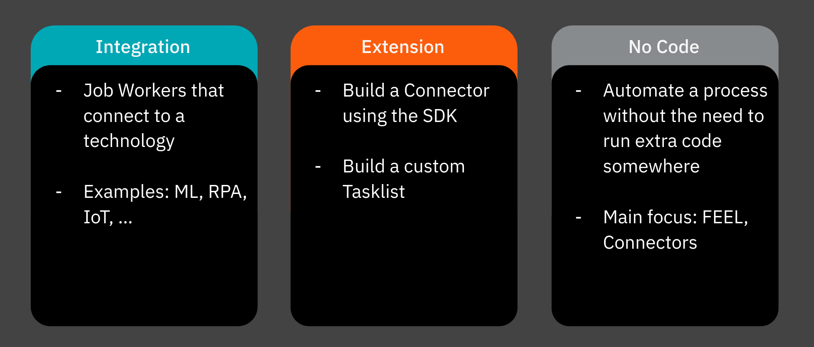
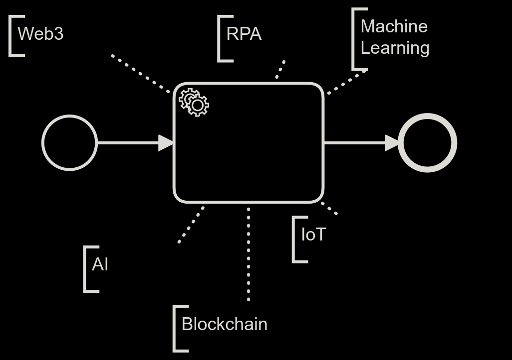
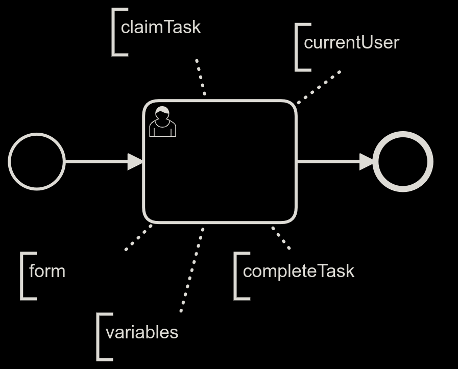
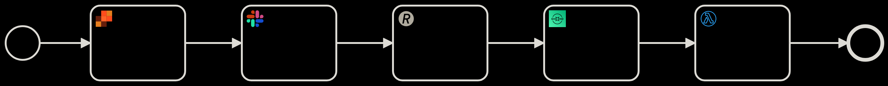

# Community-Hackday-2022
Welcome to the [Community Hackday 2022](https://page.camunda.com/camunda-community-hackday-2022). The Hackday takes place the October 4th, 2022. In this ReadMe you can find the defined challenge and useful resources to solve it. 

Happy Hacking!

## The challenge
It is all about Camunda 8. There are 3 categories to choose from: 

## Integration challenge
The main focus for this category is to integrate Camunda 8 with another technology. Your process can be quite simple. The main focus will be on the implementation of the [job worker](https://docs.camunda.io/docs/components/concepts/job-workers/). 

- Use one of the existing [clients](https://docs.camunda.io/docs/apis-clients/working-with-apis-clients/)
- Connect to the technology (code the logic)
- Define a use case (process) for your chosen technology (Don't worry you don't have to implement the whole process)

## Extension challenge
The main focus for this category is to extend Camunda 8. 

### Connectors
Build a [custom connector](https://docs.camunda.io/docs/components/integration-framework/connectors/custom-built-connectors/connector-sdk/#creating-a-custom-connector). At the moment we offer a Connector SDK for Java. So it is a good idea to have some Java knowledge to choose this challenge. 

- Choose a technology to build a connector (e.g.: [GithubAPI](https://docs.github.com/en/rest), RabittMQ or find something [here](https://free-for.dev/#/) )
- Use the [Connectors SDK](https://github.com/camunda/connector-sdk)
- Define a [connector template](https://github.com/camunda/connector-template)
- Define a use case (process) for your Connector (Don't worry you don't have to implement the whole process)

### Custom Tasklist
Build a custom [Tasklist using GraphQL](https://docs.camunda.io/docs/apis-clients/tasklist-api/tasklist-api-overview/)

- Build an own Frontend for Users
- Connect the Frontend via GraphQL 
- Define a use case for your Frontend
- [example Project](https://github.com/camunda-consulting/camunda-8-code-examples/tree/main/custom-tasklist-two-tier)

## No code challenge
The main focus is to implement and automate a process in Camunda 8 without the need to run any extra code. For this challenge your main friends will be [FEEL](https://docs.camunda.io/docs/components/modeler/feel/what-is-feel/) and [Camunda's out-of-the-box Connectors](https://docs.camunda.io/docs/components/integration-framework/connectors/use-connectors/). 

- Use as many of the out-of-the-box connectors
- Create complex Feel expressions
- Include as many BPMN symbols as possible
- Creativity over Use Case

**Useful links**
- [FEEL playground](https://nikku.github.io/feel-playground/?e=for%0A++fruit+in+%5B+%22apple%22%2C+%22bananas%22+%5D%2C+vegetable+in+vegetables%0Areturn%0A++%7B+ingredients%3A+%5B+fruit%2C+vegetable+%5D+%7D&c=%7B%0A++%22vegetables%22%3A+%5B+%22garlic%22%2C+%22tomato%22+%5D%2C%0A++%22Mike%27s+age%22%3A+35%0A%7D&t=expression)
- [FEEL tutorial](https://camunda.github.io/feel-scala/docs/tutorial/)
- [Public APIs](https://github.com/public-apis/public-apis) for the REST Connector

## Evaluation criteria
Our jury will focus on the following points for the evaluation of the projects:

* Use Case (relevance for process automation)
* Complexity
* Technical 
* Creativity (+ Fun) 
* Presentation